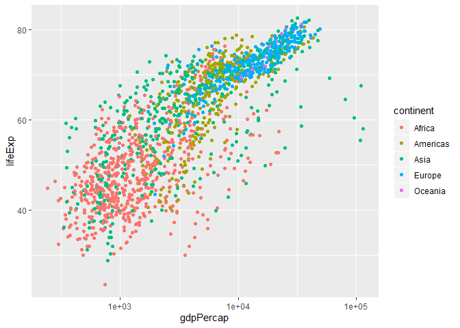
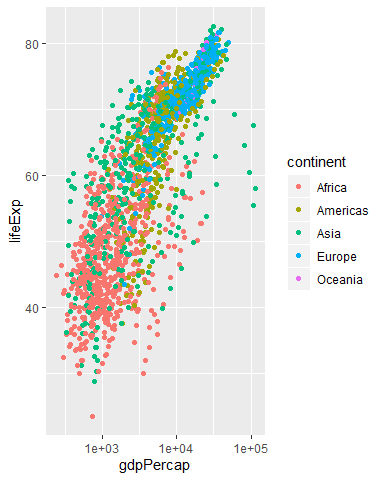

# Introduction

Here is my first R Markdown document.

# Let's embed some R code

We'll write an R chunk that loads the tidyverse package and then reads in the Gapminder datset from the data of the project.

CTRL+ALT+i (to insert code chunk)


```r
library(tidyverse)
```

```
## Warning: package 'tidyverse' was built under R version 3.6.1
```

```
## -- Attaching packages -------------------------------------------- tidyverse 1.2.1 --
```

```
## v ggplot2 3.2.1     v purrr   0.3.2
## v tibble  2.1.3     v dplyr   0.8.3
## v tidyr   0.8.3     v stringr 1.4.0
## v readr   1.3.1     v forcats 0.4.0
```

```
## Warning: package 'ggplot2' was built under R version 3.6.1
```

```
## Warning: package 'tibble' was built under R version 3.6.1
```

```
## Warning: package 'tidyr' was built under R version 3.6.1
```

```
## Warning: package 'readr' was built under R version 3.6.1
```

```
## Warning: package 'purrr' was built under R version 3.6.1
```

```
## Warning: package 'dplyr' was built under R version 3.6.1
```

```
## Warning: package 'stringr' was built under R version 3.6.1
```

```
## Warning: package 'forcats' was built under R version 3.6.1
```

```
## -- Conflicts ----------------------------------------------- tidyverse_conflicts() --
## x dplyr::filter() masks stats::filter()
## x dplyr::lag()    masks stats::lag()
```

```r
gm <- read.csv("Data/gapminder.csv")
```

# Investigate gm data


```r
head(gm)
```

```
##       country continent year lifeExp      pop gdpPercap
## 1 Afghanistan      Asia 1952  28.801  8425333  779.4453
## 2 Afghanistan      Asia 1957  30.332  9240934  820.8530
## 3 Afghanistan      Asia 1962  31.997 10267083  853.1007
## 4 Afghanistan      Asia 1967  34.020 11537966  836.1971
## 5 Afghanistan      Asia 1972  36.088 13079460  739.9811
## 6 Afghanistan      Asia 1977  38.438 14880372  786.1134
```

# Our first plot

Showing life expentancy vs gdp per capita 


```r
ggplot(gm,aes(x=gdpPercap, y=lifeExp))+geom_point()
```


# Better plot

Showing life expentancy vs gdp per capita 


```r
ggplot(gm,aes(x=gdpPercap, y=lifeExp))+geom_point(aes(col=continent))+
  scale_x_log10()
```



# Possible chunk options

https://yihui.name/knitr/options/

Options include:
- echo (TRUE by default) whether to include code in output
- results 
  - hide will hide the results
  - hold will hold all the results until the end of r chuck (show the code first and results later)
  - include (TRUE by default) if FALSE then the code will not run
  - fig.width, fig.height set the figure dimentions in the output
  - cache (FALSE by default) if TRUE save results from R chunk for the next time to save running time. Just running the new code.

# Better plot changing dimetions

Showing life expentancy vs gdp per capita 


```r
ggplot(gm,aes(x=gdpPercap, y=lifeExp))+geom_point(aes(col=continent))+
  scale_x_log10()
```



# RMarkdown table

see some data using head function


```r
head(gm)
```

```
##       country continent year lifeExp      pop gdpPercap
## 1 Afghanistan      Asia 1952  28.801  8425333  779.4453
## 2 Afghanistan      Asia 1957  30.332  9240934  820.8530
## 3 Afghanistan      Asia 1962  31.997 10267083  853.1007
## 4 Afghanistan      Asia 1967  34.020 11537966  836.1971
## 5 Afghanistan      Asia 1972  36.088 13079460  739.9811
## 6 Afghanistan      Asia 1977  38.438 14880372  786.1134
```

new head function as a table


```r
library(knitr)
```

```
## Warning: package 'knitr' was built under R version 3.6.1
```

```r
kable(head(gm))
```


country       continent    year   lifeExp        pop   gdpPercap
------------  ----------  -----  --------  ---------  ----------
Afghanistan   Asia         1952    28.801    8425333    779.4453
Afghanistan   Asia         1957    30.332    9240934    820.8530
Afghanistan   Asia         1962    31.997   10267083    853.1007
Afghanistan   Asia         1967    34.020   11537966    836.1971
Afghanistan   Asia         1972    36.088   13079460    739.9811
Afghanistan   Asia         1977    38.438   14880372    786.1134

if you like tables, look at **gt** table package.

